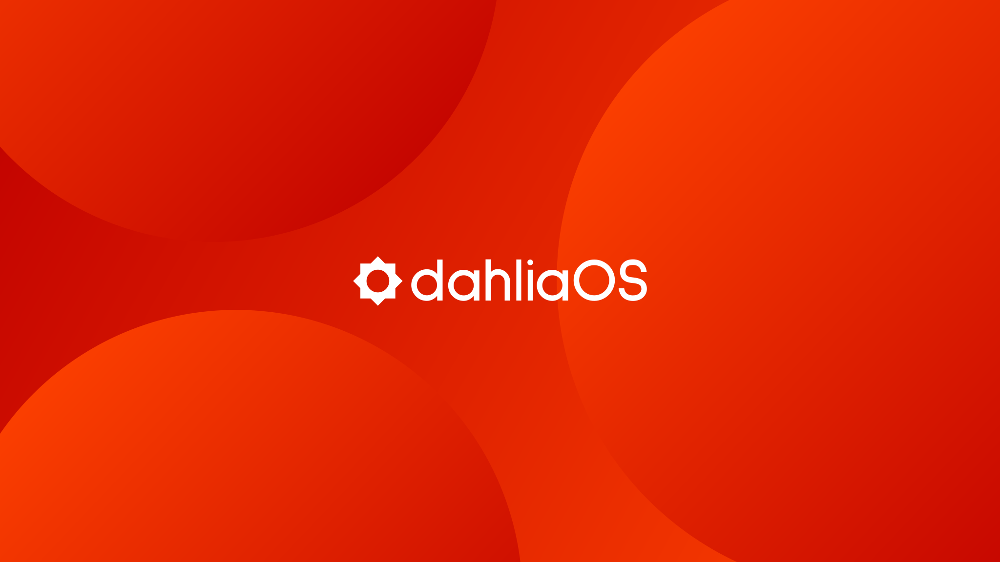

  

<a href="https://dahliaos.io">Website</a> •
<a href="https://dahliaos.io/discord">Discord</a> •
<a href="https://dahliaos.io/download">Releases</a> •
<a href="https://dahliaos.io/donate">Donate</a> •
<a href="https://docs.dahliaos.io">Documentation</a>

# dahliaOS Wallpapers

 - Official and community-made wallpapers for dahliaOS.
 - All community designs must follow the design guidelines written below.
 - With designer's consent, we might pick some community wallpapers and make them dahliaOS official ones if we like them.

## Design guidelines

* Every submitted wallpaper must be in either PNG, SVG or JPEG format.
  * Wallpapers should be atleast:
    * 3840x2160 pixels, not smaller than 1920x1080 pixels for desktops.
    * 1440x2960 pixels, not smaller than 1080x1920 pixels for mobile.
  * Optional: Upload the project file (.fig, .psd, .ai etc.).
    * Create a folder called after the project file extension where you created PNG/SVG/JPEG ones.
* dahliaOS has two main colors, Deep Orange and Shallow Orange.
  * Hex code for Deep Orange is #C00000.
  * Hex code for Shallow Orange is #FF4300.
* You can find dahliaOS brand assets [here](https://github.com/dahliaos/brand).

## Important

* **Do not** publish a wallpaper you're not an owner of.
* Licensed wallpapers are not accepted.
* Make sure your SVG isn't rasterized (Photoshop users will understand).

## Contribute

1. Make sure you meet the guidelines and understand the rules.
2. Fork the repo.
3. In the community folder, depending on if your wallpaper/s is/are for desktops or mobile phones, inside the desktop/mobile folder, make your own folder and name it after your GitHub username.
4. In the folder you just created, make a folder called after the image extension (png, svg or jpeg).
5. Put the images inside the folder.
6. Open a pull request and fill in the template.

## Contributing

If you're wondering about other ways to contribute to the project, please refer to [CONTRIBUTING.md](CONTRIBUTING.md)

## License

  
  

Copyright @ 2019-2022 - The dahliaOS Authors - contact@dahliaos.io

This project is licensed under the [Apache 2.0 license](/LICENSE)
